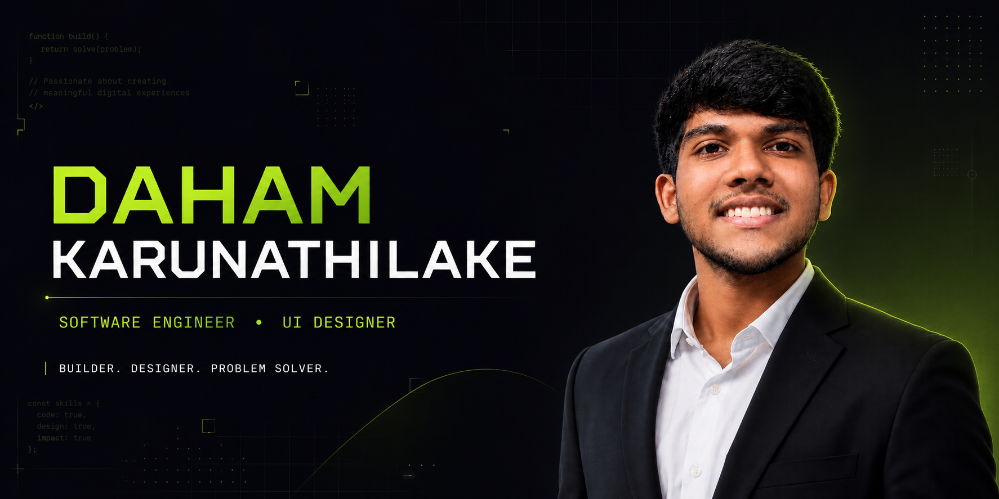

  

<h1 align="center">Daham Karunathilake</h1>

<h3 align="center"> Software Engineer • UI Designer • Digital Builder </h3>

 I build digital products that people enjoy using by combining clean engineering, thoughtful design and practical problem-solving. 

   

    

// ABOUT THE PORTFOLIO

This repository contains my personal portfolio website, created to introduce who I am, present my technical and creative skills, and showcase the projects I have developed.

I am a Software Engineer and UI Designer based in Matale, Sri Lanka. I enjoy combining development with thoughtful design to create digital experiences that are functional, visually appealing and easy to use.

The portfolio also serves as a central place for potential clients, employers and collaborators to explore my work and contact me.

Builder. Designer. Problem Solver.

// PORTFOLIO HIGHLIGHTS

<table> <tr> <td width="33%" align="center"> <h3>👨‍💻 About Me</h3> 
A brief introduction to my background, interests, values and approach to software development.
 </td> <td width="33%" align="center"> <h3>🛠️ Skills</h3> 
An overview of my technical abilities, design experience and professional strengths.
 </td> <td width="33%" align="center"> <h3>🚀 Projects</h3> 
A collection of personal, academic and client projects that demonstrate my practical experience.
 </td> </tr> </table>

// FEATURED PROJECTS
🏗️ Buildify Solutions

A professional agency website built for my digital solutions company. It presents our services, brand identity and contact information through a clean and responsive interface.

Technologies: HTML, CSS, JavaScript, UI Design and Netlify

💰 WealthyMinds

A financial literacy and wealth-management platform designed to help users organise transactions, understand their spending and make better financial decisions.

Technologies: HTML, CSS, JavaScript, UI Design and Data Structures

🛍️ Retail Website Series

A collection of responsive websites created for small businesses such as retail stores, fashion businesses, grocery shops and salons. Each website is designed around the identity and requirements of the client.

Technologies: HTML, CSS, JavaScript, Responsive Design and Client-Focused UI

// SKILLS AND TECHNOLOGIES

  

Technical Skills
Frontend web development
Responsive website design
UI and UX design
Software design and problem-solving
Git and GitHub version control
Website deployment with Netlify
Professional Strengths
Clear communication
Critical thinking
Leadership and teamwork
Attention to detail
Creative problem-solving
Fast and continuous learning
// BUILT WITH
Technology	Purpose
HTML5	Provides the website structure and content
CSS3	Controls the dark theme, responsive layout and animations
JavaScript	Adds interactions and dynamic website behaviour
Google Fonts	Provides Space Grotesk and Space Mono typography
GitHub	Manages the website source code and development history
Netlify	Hosts and deploys the live portfolio

The complete portfolio is available online:

  

// CURRENTLY AVAILABLE

I am currently open to:

Freelance web-development projects
UI and UX design opportunities
Software-engineering roles
Client website development
Collaborative technology projects

I am available for remote opportunities and local projects across Sri Lanka.

    

 📍 Matale, Central Province, Sri Lanka 

Feedback and suggestions are always welcome. If you notice an issue or have an improvement to suggest, you can open an issue or submit a pull request.

 <strong>Designed and developed by Daham Karunathilake</strong> 

 <em>Building digital experiences, one idea at a time.</em> 

 © 2026 Daham Karunathilake 

